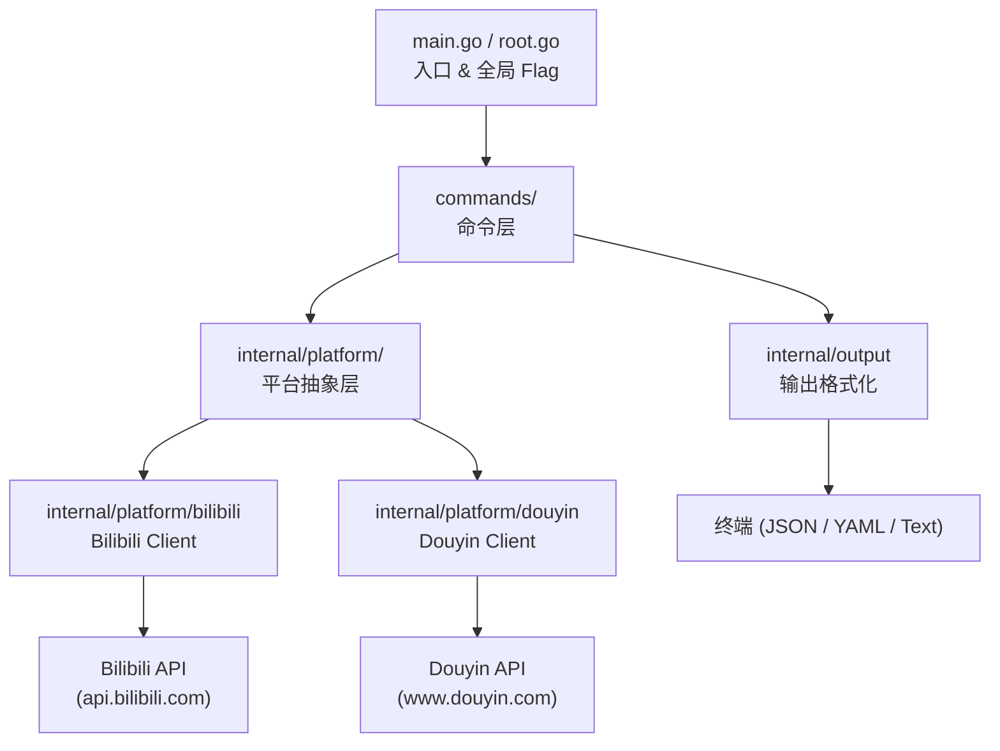
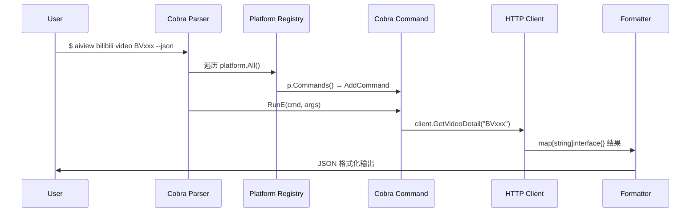

# Aiview CLI — 多平台内容 CLI 工具

A feature-rich command-line tool for Bilibili and Douyin (抖音), built in Go with Cobra. Supports video browsing, user queries, social interactions, and more.

## Architecture

```
aiview-cli/
├── main.go                          # 入口，调用 root.Execute()
├── root.go                          # 根命令，注册平台命令 + 全局 flag
├── commands/
│   ├── bilibili/                    # Bilibili 子命令层
│   │   ├── types.go                 #   Client 接口 | 类型定义
│   │   ├── video.go, user.go, ...   #   各命令实现
│   └── douyin/                      # Douyin 子命令层
│       ├── types.go                 #   Client 接口 | 类型定义
│       ├── hot.go, video.go, ...    #   各命令实现
├── internal/
│   ├── platform/
│   │   ├── platform.go              #   Platform 接口定义
│   │   ├── registry.go              #   全局平台注册器
│   │   ├── bilibili/
│   │   │   ├── bilibili.go          #   BilibiliPlatform: Commands() + 委托
│   │   │   ├── client.go            #   HTTP Client → Bilibili API
│   │   │   ├── auth.go, login.go    #   认证 & 登录
│   │   │   └── bilibilitypes/       #   共享类型 (VideoInfo, Credential...)
│   │   └── douyin/
│   │       ├── douyin.go            #   DouyinPlatform: Commands() + 委托
│   │       ├── client.go            #   HTTP Client → Douyin API
│   │       └── auth.go              #   Cookie 持久化
│   ├── output/                      # JSON/YAML/Text 输出格式化
│   └── config/                      # 配置加载 (viper)
└── docs/                            # 文档
    ├── TEST_REPORT_BILIBILI.md
    └── TEST_REPORT_DOUYIN.md
```

### Layered Architecture



### Request Flow



## Quick Start

```bash
# Login with cookie
aiview bilibili login --sessdata "<SESSDATA>" --bili-jct "<BILI_JCT>"

# Check status
aiview bilibili status

# Browse a video
aiview bilibili video BV1GJ411x7Rq --json

# View user info
aiview bilibili user 37737161
```

## Commands

### ✅ Account
| Command | Description | Status |
|---------|-------------|--------|
| `login --sessdata` | Login with cookie | ✅ Done |
| `login --qrcode` | QR code login | ✅ Done |
| `logout` | Clear saved credentials | ✅ Done |
| `status` | Check login status | ✅ Done |
| `whoami` | Show current user info | ✅ Done |
| `video-status <BV>` | View video statistics | ✅ Done |
| `relation <UID>` | View relation status | ✅ Done |

### ✅ User
| Command | Description | Status |
|---------|-------------|--------|
| `user <UID>` | View user info | ✅ Done |
| `user-videos <UID>` | View user's video list | ✅ Done |
| `fans <UID>` | View fans list | ✅ Done |
| `following <UID>` | View following list | ✅ Done |

### ✅ Video
| Command | Flags | Status |
|---------|-------|--------|
| `video <BV>` | `--subtitle, --ai, --comments, --related` | ✅ Done |
| `tags <BV>` | — | ✅ Done |
| `online <BV>` | — | ✅ Done |

### ✅ Discovery
| Command | Description | Status |
|---------|-------------|--------|
| `hot` | View trending videos | ✅ Done |
| `rank` | View rankings | ✅ Done |
| `feed` | View dynamic feed (login required) | ✅ Done |
| `search <keyword>` | Search videos/users | ✅ Done |
| `suggest <keyword>` | Get search suggestions | ✅ Done |
| `recommend` | Get homepage recommendations | ✅ Done |
| `region <rid>` | View videos by region | ✅ Done |
| `trending` | View trending/hot search keywords | ✅ Done |
| `precious` | View must-watch (入站必刷) curated videos | ✅ Done |
| `weekly <number>` | View weekly hot video series | ✅ Done |

### ✅ Collections & Storage
| Command | Description | Status |
|---------|-------------|--------|
| `favorites <UID>` | View favorite folders | ✅ Done |
| `favorite <BV>` | Add/remove video from favorites | ✅ Done |
| `collection <UID>` | View user's video collections | ✅ Done |
| `history` | View watch history | ✅ Done |
| `watch-later` | View watch later list | ✅ Done |

### ✅ Interactions
| Command | Description | Status |
|---------|-------------|--------|
| `like <BV>` | Like/unlike a video | ✅ Done |
| `coin <BV>` | Give coins to a video | ✅ Done |
| `triple <BV>` | Like + Coin + Favorite | ✅ Done |
| `unfollow <UID>` | Unfollow a user | ✅ Done |

### ✅ Comments & Danmaku
| Command | Description | Status |
|---------|-------------|--------|
| `comment <BV>` | View comments | ✅ Done |
| `comment-delete <ID>` | Delete a comment | ✅ Done |
| `danmaku <BV>` | View danmaku | ✅ Done |
| `danmaku-send <BV>` | Send a danmaku | ✅ Done |

### ✅ Dynamics
| Command | Description | Status |
|---------|-------------|--------|
| `dynamic <UID>` | View user's dynamics | ❌ B站风控限流 |
| `dynamic-post <text>` | Post a text dynamic | ✅ Done |
| `dynamic-delete <id>` | Delete a dynamic | ✅ Done |

### ✅ Audio & Live
| Command | Description | Status |
|---------|-------------|--------|
| `audio <BV>` | Download audio and split into WAV (requires ffmpeg) | ✅ Done |
| `live` | View live room info | ✅ Done |

## Global Flags

```bash
--json    Output in JSON format
--yaml    Output in YAML format
-v, --verbose  Enable verbose logging
```

## Limitations & Known Issues

| Issue | Description | Workaround |
|-------|-------------|------------|
| `dynamic (user space)` | B站 rate limits user space dynamics API | Use `feed` for followed users' dynamics, or retry with delays |
| `live` | Non-existent rooms return HTML error | Use a valid room ID |
| `username encoding` | Chinese usernames may show garbled on Windows terminal | The JSON output contains correct Unicode data |

## Build

```bash
cd aiview-cli
go build -o aiview-cli.exe .
```

## Dependencies

- [Cobra](https://github.com/spf13/cobra) — CLI framework
- [ffmpeg](https://ffmpeg.org/) — Required for audio WAV splitting (`audio --segment`)
- Go 1.21+

## Douyin Platform

Commands for Douyin (抖音) content discovery and video/user data.

### Commands

| Command | Usage | Status | Description |
|---------|-------|--------|-------------|
| `hot` | `douyin hot [--json\|--yaml]` | ✅ Done | View trending/hot search on Douyin |
| `trending` | `douyin trending [--json\|--yaml]` | ✅ Done | View trending topics/challenges |
| `search` | `douyin search <keyword> [--page N] [--count N]` | ⚠️ Partial | Search Douyin content (requires cookies for full results) |
| `video` | `douyin video <video_id\|share_url>` | ⚠️ Cookie | View video details (requires login) |
| `user` | `douyin user <uid>` | ⚠️ Cookie | View user profile info (requires login) |
| `comment` | `douyin comment <video_id> [--cursor N]` | ⚠️ Cookie | View video comments (requires login) |
| `user-posts` | `douyin user-posts <uid> [--cursor N]` | ⚠️ Cookie | View user's video posts (requires login) |
| `login` | `douyin login --cookie <cookie>` | ✅ Done | Login with browser cookie |
| `status` | `douyin status` | ✅ Done | Check login status |
| `logout` | `douyin logout` | ✅ Done | Clear saved credentials |

### Notes
- `hot` and `trending` work without authentication
- `video`, `user`, `comment`, `user-posts` require `douyin login --cookie <cookie>` first
- `search` returns limited results without cookies

## Test Reports

- [Bilibili 平台测试报告](docs/TEST_REPORT_BILIBILI.md)
- [Douyin 平台测试报告](docs/TEST_REPORT_DOUYIN.md)